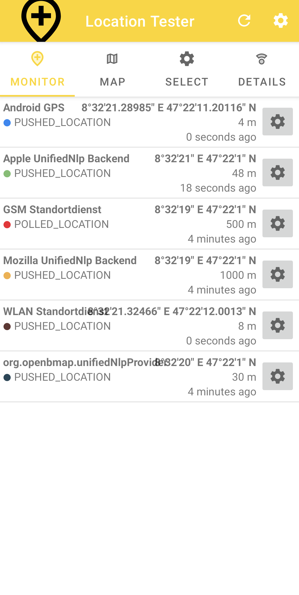

Location Tester
===============

This application helps you test and understand the UnifiedNlp API 
(Unified Network Location Provider) and its backends / plugins.
 
Use it to test Unified Network Location Providers one by one
or multiple at the same time, across devices and locations. There is 
no need to install the [UnifiedNlp Service](https://github.com/microg/UnifiedNlp) 
itself. Only plugins / backends are needed. A list of plugins is 
available at [F-Droid](https://f-droid.org/en/packages/com.google.android.gms/).

## Screenshots

**Main View** | **MapView**
--- | ---
|
**Selection View** | **Details View**
|

## Features
* Allows to select any installed UnifiedLocation providers,
  as well as the android network, gps and passive providers.
* Queries selected location providers individually
* Shows location results per provider as a list and/or on a map.
* Shows provider details, and lets you open the providers
  configuration dialog.

## Requirements

* At least Android 5.1, has been tested on Android 10 and 11.
* The Map View uses Open Street Map Data (Mapnik).
  It requires an internet connection.
  
## Displayed States

| State              | Meaning                                                  |
| ------------------ | -------------------------------------------------------- | 
| NOT_INSTALLED      | Buildin: The Location Provider appears to be not installed on this system  
| NO_PERMISSION      | Location permissions have not been granted to us. Click on the row to request the permissions.
| DISABLED           | Locations are disabled in android settings. Click on the row to go to the settings.
| BINDING            | UnifiedNlp: we are trying to bind to service.               |
| WAITING            | We are waiting to retrieve a location. Click to re-poll for a location.   |
| CACHED_LOCATION    | Buildin: we retrieved a cached location. Click to clear the location and re-poll. |
| POLLED_LOCATION    | UnifiedNlp: we polled for a location, and got one. Click to clear the location and re-poll. |
| PUSHED_LOCATION    | Buildin/Unified: the location was actively pushed to us. Click to clear the location (and re-poll).  |

## Troubleshooting

To properly work, the location backends/plugins need to be granted background
location permissions. You can go to the details page for each plugin by clicking
on the settings icon next to the plugin. Clicking on "App Settings" will
take you to the Android Settings Page for the application. 
You can grant the permissions on this page.

Some backends need to be configured before they work. You can open their 
initialization / configuration dialog on the settings page, if they have one.

Some backends might not actively push location data. Click on their row in the main view
to re-poll for a location.

If you are unable to get a location of a backend after granting all permissions and
configuring it, the backend might be incompatible with you android version and/or
is buggy. 